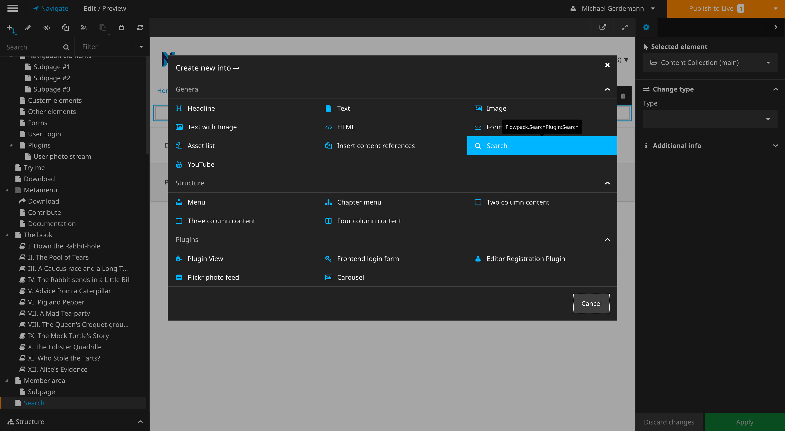
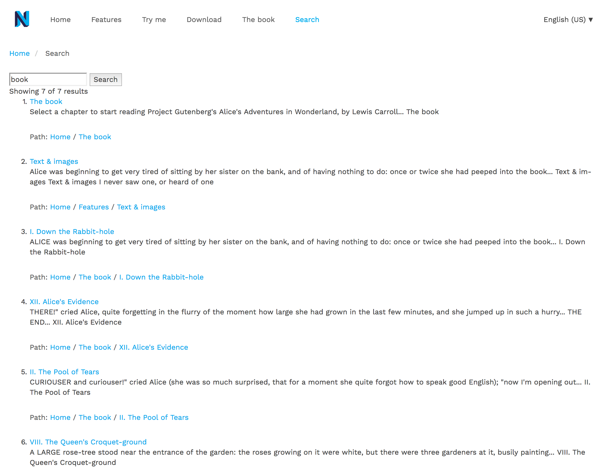

Is it difficult to get a powerful search for your homepage? With Neos and Elasticsearch this is now a breeze. In 5 easy steps to your own Elasticsearch search.

### Step 1:

Install the two packages _'flowpack/elasticsearch-contentrepositoryadaptor'_  and 'flowpack/searchplugin' via composer:

```bash
composer require 'flowpack/elasticsearch-contentrepositoryadaptor'
composer require 'flowpack/searchplugin'
```

### Step 2:

Configure Elasticsearch depending on version. See the official documentation:  
[Flowpack.ElasticSearch.ContentRepositoryAdaptor Documentation](https://github.com/Flowpack/Flowpack.ElasticSearch.ContentRepositoryAdaptor#elasticsearch-configuration-file-elasticsearchyml)  

### Step 3:

Configure the Elasticsearch packages and store the appropriate version and the appropriate data for the Elasticsearch server:  

```yaml
Flowpack:
  ElasticSearch:
    ContentRepositoryAdaptor:
      driver:
        # Version of Elasticsearch
        version: 2.x
    clients:
      default:
        # Data of the Elasticsearch server
        -
          host: elasticsearch
          port: 9200
          username: ''
          password: ''
```

### Step 4:

With the flow command _'nodeindex: build'_, the contents are indexed and can be found from then on:

```bash
./flow nodeindex:build
```

### Step 5:

Then we just have to put the search plugin on a page:



After these 5 steps we have a fully functional search:  



### Nice to have:

So that the search is not only functional, but also looks pretty, I recommend to improve the search a bit with CSS.

### Further Links / Documentations:

With this base you have many other possibilities to improve the search. More information can be found in the following documentations:

* [https://github.com/Flowpack/Flowpack.ElasticSearch.ContentRepositoryAdaptor](https://github.com/Flowpack/Flowpack.ElasticSearch.ContentRepositoryAdaptor)
* [https://github.com/Flowpack/Flowpack.ElasticSearch/blob/master/Documentation/Index.rst](https://github.com/Flowpack/Flowpack.ElasticSearch/blob/master/Documentation/Index.rst)
* [https://github.com/Flowpack/Flowpack.SearchPlugin](https://github.com/Flowpack/Flowpack.SearchPlugin)