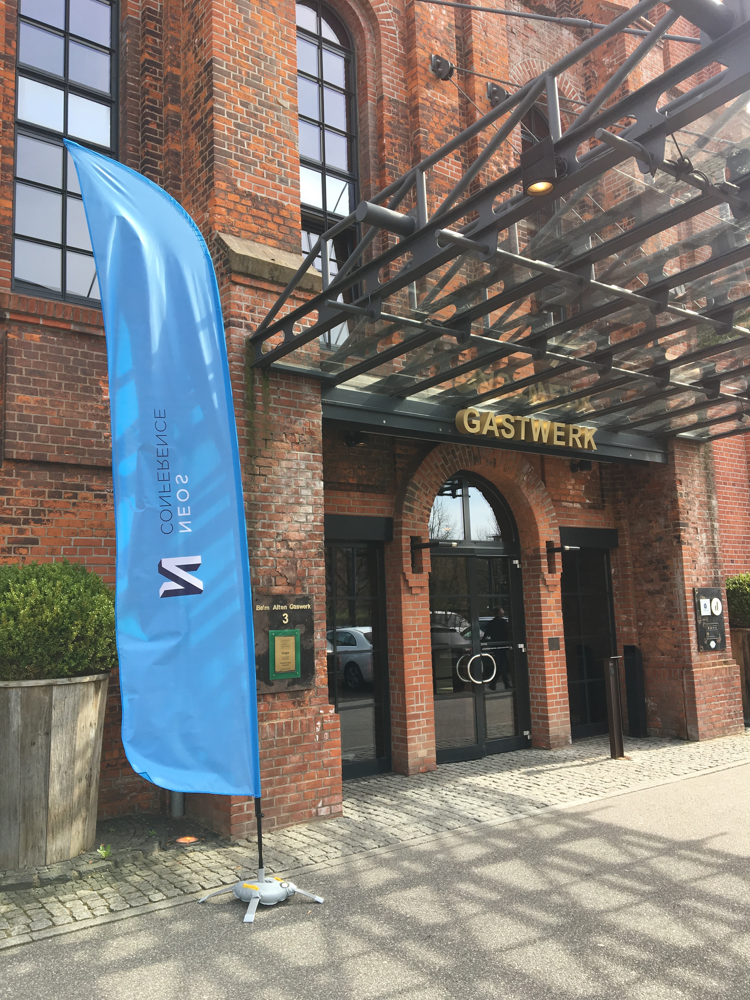
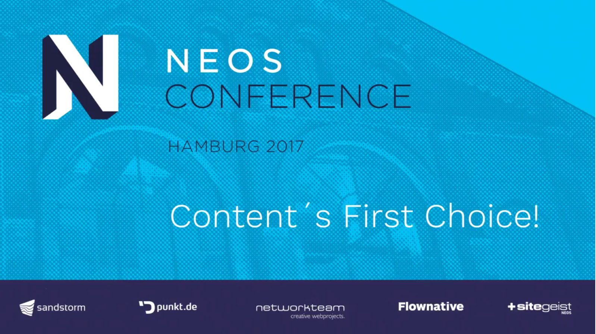
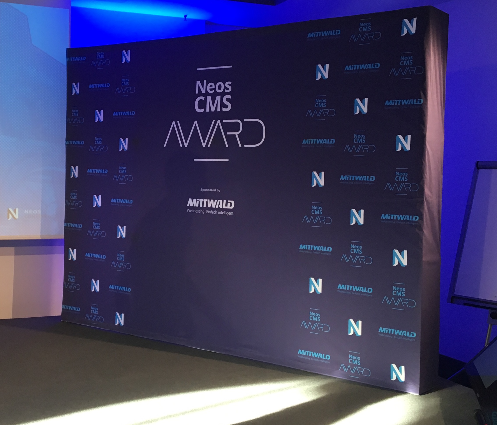

Last Friday and Saturday the first Neos Conference took place. It was as in previous years at the inspiring conference, an awesome one with many good talks, interesting discussions and good food.  

The venue was the Hotel Gastwerk in Hamburg, the former gas factory linked from the design to the last year's venue of the Inspiring Conference and offered the perfect setting for this great event.  

The Talks
---------

Let's get to the talks: These were once again high-profile. There was something for the beginners, as well as for advanced participants. Also the Lightning Talks on the second day were a great format with short but informative presentations.

There was even, for all who could not attend, a live stream on Youtube.  

Talks on the first day
----------------------

##### Welcome Keynote

The conference was opened by the founder of the open source project Neos, _Robert Lemke_. _Tobias Gruber_ also had a brief appearance in the keynote.

[» Youtube-Video](https://youtu.be/8SXfms-qoKE?list=PLmMUGpq3yu-jdH1-YEarQyOVaAk1ub0U1)

[» Slides](https://www.slideshare.net/robertlemke/neos-conference-2017-welcome-keynote)

##### A round trip through your presentation layer in Neos

This talk by _Dmitri Pisarev_ and _Dominique Feyer_ focuses, as the title suggests, the presentation layer of Neos. Why it is useful to have clear templates and to relocate the logic from Fluid templates to Fusion.  

[» Youtube-Video](https://youtu.be/8bZikINA2UA?list=PLmMUGpq3yu-jdH1-YEarQyOVaAk1ub0U1)

[» Slides](https://speakerdeck.com/dfeyer/a-round-trip-through-your-presentation-layer-with-fusion)

##### Integrating with 3rd parties

_Bastian Waidelich_ talked in his presentation about the integration of Neos with 3rd parties and shows possibilities and concepts.  

[» Youtube-Video](https://youtu.be/Rfb1IUdUVN4?list=PLmMUGpq3yu-jdH1-YEarQyOVaAk1ub0U1)

[» Slides](http://www.wwwision.de/neoscon2017/)

##### A practical introduction to event sourcing and CQRS

A major topic of the conference was event sourcing and CQRS. _Robert Lemke_ presented an introduction to this interesting topic.

[» Youtube-Video](https://youtu.be/cUXi9fUqWQ0?list=PLmMUGpq3yu-jdH1-YEarQyOVaAk1ub0U1)

[» Slides](https://www.slideshare.net/robertlemke/a-practical-introduction-to-event-sourcing-and-cqrs)

##### Neos & Flow Showcases

In the slot for the Neos & Flow Showcases three Neos and flow projects were presented. The first project, a Neos online shop ([https://www.roemerturm.de/](https://www.roemerturm.de/)), was presented by _Christian Müller_. The second showcase, the t3n universe (Flow & Neos projects) was presented by _Johannes_ _Steu_. And the last but not least project was presented by _Matthis Radke_, the "1&1 Partnerportal".

[» Youtube-Video (Neos as a Shop)](https://youtu.be/JuAZPQ7u7Ho?list=PLmMUGpq3yu-jdH1-YEarQyOVaAk1ub0U1)

[» Youtube-Video (Two stack CMS - Neos in an enterprise setup)](https://youtu.be/SvE5FJT8xO8?list=PLmMUGpq3yu-jdH1-YEarQyOVaAk1ub0U1)

[» Youtube-Video (Neos and Flow with Event Sourcing)](https://youtu.be/YHCmQcF9FYU?list=PLmMUGpq3yu-jdH1-YEarQyOVaAk1ub0U1)

##### Atomic.Fusion and a living style guide for Neos

_Martin_ _Ficzel_ and _Wilhelm Behncke_ presented their idea of Atomic. Fusion and how a living style guide is created, almost by itself.  

[» Youtube-Video](https://youtu.be/lIY0epkqwxg?list=PLmMUGpq3yu-jdH1-YEarQyOVaAk1ub0U1)

[» Slides](https://speakerdeck.com/sitegeist/atomic-dot-fusion-and-sitegeist-dot-monocle-neos-conference-2017)

##### Search as main navigation

Can a search replace the main navigation? _Daniel Lienert_ and _Sebastian_ _Helzle_ say yes and show how to implement it with Neos.  

[» Youtube-Video](https://youtu.be/Rd8MlXS2ofo?list=PLmMUGpq3yu-jdH1-YEarQyOVaAk1ub0U1)

[» Slides](https://de.slideshare.net/punktde/search-as-main-navigation)

##### Keynote - Messages over Structure

The last talk of the first day was held by _Mathias Verraes_. It was again about the subject of event sourcing and CQRS. His recommendation in the planning of projects is that one should rather talk about messages rather than structures.  

[» Youtube-Video](https://youtu.be/2nDNMB_wXcE?list=PLmMUGpq3yu-jdH1-YEarQyOVaAk1ub0U1)

Talks on the second day
-----------------------

##### Keynote - Behind the Scenes of Maintaining an Open Source Project

The second conference day began with a keynote by _Jordi Boggiano_, author of Composer and [packagist.org](http://packagist.org). He talked about the maintenance of open source projects, the positive as well as the negative aspects came into the language.  

[» Youtube-Video](https://youtu.be/Ci_I0ATr748?list=PLmMUGpq3yu-jdH1-YEarQyOVaAk1ub0U1)

[» Slides](http://slides.seld.be/?file=2017-04-01+Behind+the+Scenes+of+Maintaining+an+Open+Source+Project.html)

##### No more “Lorem Ipsum” - wireframing and content first with Neos CMS

_David_ _Spiola_ presented his solution for wireframing projects directly in Neos. He showed, how he designed new projects directly with the customer in Neos with real content.  

[» Youtube-Video](https://youtu.be/MT23DoRo77g?list=PLmMUGpq3yu-jdH1-YEarQyOVaAk1ub0U1)

##### The Neos React UI

There are great times on Neos, the development of the new backend [React UI](https://github.com/neos/neos-ui) is going into the hot phase. _Sebastian Kurfürst_ presented the status quo and the first beta was released.  

[» Youtube-Video](https://youtu.be/2jkVX_wKpjc?list=PLmMUGpq3yu-jdH1-YEarQyOVaAk1ub0U1)

##### Lightning Talks

In contrast to the longer talks, there was a session with Lightning Talks. 7 talks with 5 minutes each. There were kept short but nevertheless very interesting presentations.  

[» Youtube-Video](https://youtu.be/0iJ9TrXHLuI?list=PLmMUGpq3yu-jdH1-YEarQyOVaAk1ub0U1)

[» Slides (Asset Meta Data Management With Neos CMS)](https://speakerdeck.com/dlienert/asset-meta-data-management-with-neos-cms)

##### Passcreator: our journey to the cloud

Is flow scalable and how can you do it? _David Sporer_ showed his solution for Passcreator based on docker.  

[» Youtube-Video](https://youtu.be/bbT0Uu3KFuI?t=4h39m)

##### Neos and SEO

Neos and SEO is not a contradiction, _Sebastian Helzle_ presented what possibilities of SEO optimization with Neos exist.  

[» Youtube-Video](https://youtu.be/BOyhHgqGtao?list=PLmMUGpq3yu-jdH1-YEarQyOVaAk1ub0U1)

[» Slides](https://www.slideshare.net/Sebobo/neos-cms-and-seo)

##### From the Labs

The last talk went into the depths again. _Christopher Hlubek_ and _Bernhard Schmitt_ once again presented the benefits of event sourcing and CQRS and what that could mean for the future of Neos.  

[» Youtube-Video](https://youtu.be/HS4iZooSawA?list=PLmMUGpq3yu-jdH1-YEarQyOVaAk1ub0U1)

The Neos Award
--------------

For the second time in history, the Neos Award was presented. 

The winners in the category "**Excellence**" are:

1.  H-Hotels.com ([https://www.h-hotels.com/](https://www.h-hotels.com/))
2.  Swisscom Mailer ([https://www.swisscom.ch](https://www.swisscom.ch))
3.  Silberregion Karwendel ([https://www.silberregion-karwendel.com/](https://www.silberregion-karwendel.com/))

The **bronze** winner:  
Meister ([https://www.meister.com/](https://www.meister.com/))

The **silver** winner:  
Passcreator ([http://www.passcreator.com/](http://www.passcreator.com/))

The **gold** winner:  
1&1 Partner-Portal

And the community friendly ghost award went to [Dmitri Pisarev](http://dimaip.github.io/).

[» Youtube-Video](https://youtu.be/RSHi6Mo82iM?t=9h27m30s)

Conclusion
----------

My personal conclusion is extremely positive. It was a great Neos conference, it's a great community and a great project. I hope it goes in the future Neos continue steeply uphill and I am looking forward to the next Neos event.