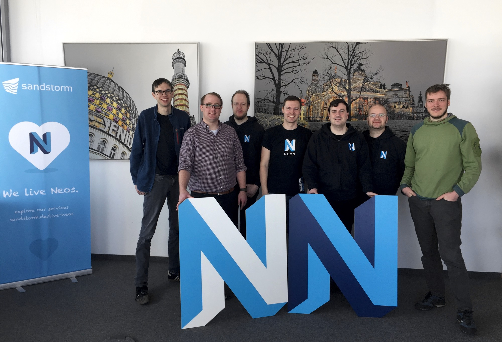
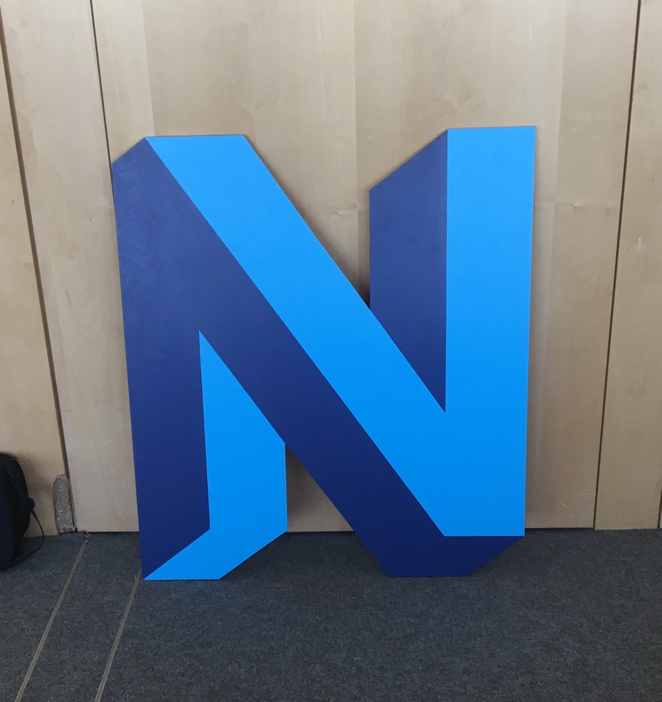

From 26.02. to 02.03. a Neos Sprint took place in Dreden. This time I had the opportunity to participate. The topic of the sprint was the new Event Sourced Content Repository.  

## What is the Content Repository?

The **Content Repository is the heart of Neos**, where, as the name suggests, all content is stored. Contents are not only simply texts or pictures, in Neos the contents are structured by so-called **NodeTypes**. A NodeType definition gives structure to the content by specifying properties and relationships to other content.  

The Content Repository also takes care of **workspaces** and **content dimensions**. The workspaces can be used, for example, to ensure that content changes do not have to be made live immediately, but that they are initially published and collected in a special workspace such as "Preview".  

The **content dimensions** are another powerful part of Neos. In the simplest case, you can use it to create translations. You can also create dimensions for different scenarios. For example, to provide content for specific target groups or markets.  

## Event Sourced CR - Why at all?

In order to be able to implement the increasing requirements for the CR, some adaptations are necessary, because the current status hardly offers any possibilities to implement these adaptations, e. g. an undo function.

The Neos team has been dealing with **event sourcing** for a long time. There was also a workshop with the expert Mathias Verraes. Based on this experience, the decision was made to convert the Content Repository to event sourcing.

The special thing about event sourcing is the other way of thinking. Instead of storing the data in finished data structures, the data is stored in events. An event is a structured message with all relevant data for the current activity.  

An example is changing a property. In the "old" case, the property would be immediately overwritten in the database, all information when and by whom and especially what was in the field before would be lost. In event sourcing, only an event is created with all relevant data, such as the new value. The data record is not changed until the event is executed. This has the advantage that you can reset the data record to any state afterwards. The only "truth" in this case are the events and not the actual data set.  

Another advantage is that you can still change the data structure without having to be afraid that the data does not fit. You just change the projection and replay the events.  

For more information on Content Repository 2.0, [click here](https://www.neos.io/blog/content-repository-2nd-edition.html). You can find out more about specific technical details [here](https://sandstorm.de/de/blog/post/event-sourced-content-repository.html).

## Progress and goals of the sprint

After the start in [Kiel](https://www.neos.io/blog/content-repository-2nd-edition.html), the plan was to further rebuild the new content repository in Dresden. The progress was also great in Dresden, e. g. content could be edited and published again. It is possible to link other nodes and move them within the content graph.

Bugs have been identified and fixed. Conceptual discussions were held and the next steps were discussed. A big step towards completion has been taken. There is still some work to be done, but there is no doubt about the feasibility of the new Content Repository!

You can find the current state of development on [Github](https://github.com/neos/neos-development-distribution/tree/event-sourced) in the branch "event-sourced".

At this point a big thank you to the Neos Core Team for the nice welcome in the sprint! I'm already looking forward to the next sprint that I can participate in.