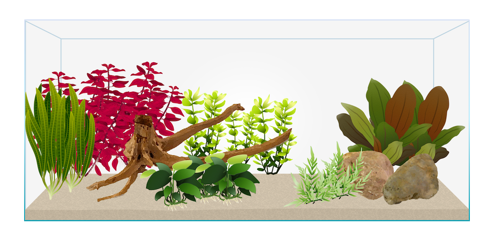

Vor über einem Jahrzehnt war ich der stolze Besitzer eines farbenfrohen, lebendigen Aquariums.
Nun haben wir uns entschieden, diese besondere Leidenschaft als Familie wieder aufleben zu lassen.

Gemeinsam haben wir, voller Vorfreude, ein neues Aquarium bestellt. Es wird ein 180 Liter Aquarium (100x40x45cm)
von [EHEIM](https://eheim.com/de_DE/aquaristik/aquarien/aquarien-suesswasser/vivalineled/vivalineled-180?number=0613049).
Doch wie es das Leben manchmal so spielt, hat sich die Lieferung verzögert. Anfänglich enttäuschend,
bietet uns diese Verzögerung allerdings die Gelegenheit, uns als Familie besser auf dieses aufregende
gemeinsame Abenteuer vorzubereiten.

Unser altes, seit Jahren auf dem Dachboden schlummerndes Aquarium, erfüllt in der Zwischenzeit eine neue Funktion.
Hier haben wir verschiedene Pflanzen wie die Cryptocoryne becketti "petchii", Echinodorus 'Reni', Echinodorus 'Ozelot green',
Ludwigia palustris "Super Red", Eleocharis acicularis und Egeria densa gepflanzt, begleitet von drei kleinen Moosbällen.
Sie gedeihen prächtig und bereiten sich darauf vor, bald in unserem neuen Aquarium ein Zuhause zu finden.

Zusätzlich zu den Pflanzen und dem laufenden Filter haben wir noch ein technisches Highlight eingebaut: Eine CO2-Anlage.
Diese Anlage ist besonders wichtig für das Wachstum und die Entwicklung der Pflanzen. Sie versorgt sie mit dem
lebenswichtigen Gas, das sie für die Photosynthese benötigen. Momentan testen wir die CO2-Anlage bei den Pflanzen
in unserem alten Aquarium, um sicherzustellen, dass sie optimal funktioniert, bevor wir sie in unser neues
Aquarium einbauen. Diese technische Erweiterung verspricht, das Erlebnis unseres Familienaquariums noch
beeindruckender und interaktiver zu gestalten.

Parallel dazu bereiten wir eine Wurzel im Wasser vor. Sie wird nicht nur eine visuelle Bereicherung für unser neues
Aquarium sein, sondern auch einen natürlichen Lebensraum für unsere zukünftigen Wasserbewohner bieten.

Ein weiterer wichtiger Schritt in der Vorbereitungsphase ist der Hamburger Mattenfilter (HMF), der bereits in
unserem alten Aquarium aktiv ist. Dieser Filtertyp ist für seine Langlebigkeit und Effizienz bekannt
und schafft die idealen Bedingungen für die Ansiedlung von Bakterien. Diese kleinen unsichtbaren Helfer sind
für ein gesundes Ökosystem unerlässlich. Der HMF bereitet so schon jetzt das künftige Zuhause unserer Wasserbewohner vor.

Bei den zukünftigen Bewohnern unseres Aquariums spielen wir mit einigen Ideen: Amanogarnelen, Platys, Guppies, Neons, Panzerwelse.
Aber das sind nur erste Überlegungen - wir sind gespannt, welche Tiere letztendlich in unser Familienaquarium einziehen werden
und freuen uns auf die Freude, die sie in unser gemeinsames Leben bringen werden.

In der Zwischenzeit haben wir auch eine grobe Layout-Vorstellung für unser neues Aquarium entwickelt, die wir digital skizziert haben.
Es ist aufregend, unsere Vision auf dem Bildschirm zu sehen, und die Vorfreude auf den Moment, in dem das Design zum Leben
erweckt wird, wächst mit jedem Tag.

Dieser Prozess, diese gemeinsame Reise, ist eine perfekte Mischung aus Wissenschaft und Kunst, Geduld und Sorgfalt.
Es ist ein Wiederbeleben der alten Leidenschaft, die mich vor über einem Jahrzehnt begeisterte, diesmal mit meiner Familie an meiner Seite.

Bleib dabei und begleite uns auf dieser aufregenden Reise. Wir freuen uns darauf, unsere Erlebnisse, Erfolge und Herausforderungen
mit dir zu teilen, während wir dieses Unterwasser-Paradies gemeinsam zum Leben erwecken. Denn was könnte aufregender sein,
als einen neuen Lebensraum zu schaffen?